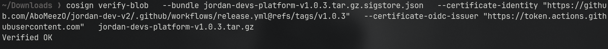

## Task 1: [PR](https://github.com/AboMeezO/jordan-dev-v2/pull/10)

I added a simple dependabot config file and also fixed the actions versions to specific hashes to ensure integrity.

## Task 2
For this task I've written a github actions workflow to build, bundle and sign my releases on tag pushing, the PR that introduced it is [PR1](https://github.com/AboMeezO/jordan-dev-v2/pull/11) and [PR2](https://github.com/AboMeezO/jordan-dev-v2/pull/12) fixed some issues of the first one, I made up a tag that triggered the release.yml workflow, I installed the tarball archive with the sigstore bundle (as it's the new standard), I verified the integrity using the command in this 


# Task 3 – Generate and Read an SBOM
For this task, I generated a Software Bill of Materials (SBOM) for my repository `jordan-dev-v2`, executed a dependency vulnerability scan against it, and performed a deeper analysis of one of the reported security findings.

## Generating the SBOM

I utilized **Syft** to construct a CycloneDX-formatted JSON SBOM directly from the repository's dependency manifest.

```bash
syft . --output cyclonedx-json=sbom.json

```

The tool inspected the workspace configuration files and lockfiles to catalog all unique packages. By running `jq` against the output file, I was able to verify the total component count tracked within the SBOM:

```bash
jq '.components | length' sbom.json

```

**Output verified:**

* **Total Components mapped:** 418 components


## Scanning the SBOM

Next, I used **Grype** to run a vulnerability scan targeting the newly created static SBOM file:

```bash
grype sbom:./sbom.json

```

**Grype Scan Summary:**

* **Total vulnerabilities discovered:** 15
* **Critical:** 0
* **High:** 6
* **Medium:** 3
* **Low:** 6
* **Negligible:** 0

### Scan Observations

Unlike environment-wide OS scans, this application-level dependency check concentrated vulnerabilities primarily within our Node.js runtime layers and package registry trees. The bulk of the flagged risks were associated with the following NPM packages:

* `undici` (the HTTP/1.1 client integrated into modern Node.js)
* `effect` (the functional concurrency/fiber runtime)
* `@clerk/clerk-react` (authentication helper utilities)

Notably, 14 out of the 15 flagged items have direct patches ready, while only 1 low-severity package (`@ai-sdk/provider-utils`) remains unpatched upstream.

## Investigating a Specific Vulnerability

I selected the following high-severity asynchronous runtime flaw to investigate:

* **Vulnerability ID:** GHSA-38f7-945m-qr2g / CVE-2026-32887
* **Impacted Package:** `effect`
* **Detected Version:** `3.16.12`
* **Fixed Version:** `3.20.0`

### What is the vulnerability?

The vulnerability centers on how the `effect` package handles context tracking inside its custom asynchronous microtask scheduler (`MixedScheduler`).

Node.js uses `AsyncLocalStorage` (ALS) to store request-specific scope details down an async execution flow (such as the active user's credentials, active session IDs, or telemetry traces). Under high concurrent loads, the custom scheduler in `effect` groups running tasks into single batches to optimize execution.

However, affected versions of the library failed to isolate the native `AsyncLocalStorage` state between individual fibers when running a batched group. As a result, a running task processing User B's request could run inside the stored context memory context of User A, leading to data leaking across concurrent sessions.

### Who is affected?

* Applications running `effect` core versions **prior to `3.20.0**`.
* Systems that concurrently process web requests and rely on `AsyncLocalStorage` to manage auth, tenant isolation, or request-specific logging contexts.

### What is the fix?

Upgrade the local dependency to version `3.20.0` or higher, where the scheduler mechanics were updated to properly partition and restore isolated async scopes for every running fiber.

To apply this to my project:

I'll check if I can rely on Dependabot to handle the dependency updates itself, if not, I'll manually update the dependency.


## Task 4
To keep it short, I checked a repo using Openssf scorecard checker and I found some vulnerabilities, I managed to solve some of them without breaking the existing code (I updated the needed packages to solve some), the pr is [HERE](https://github.com/meshery/meshery/pull/20779)
